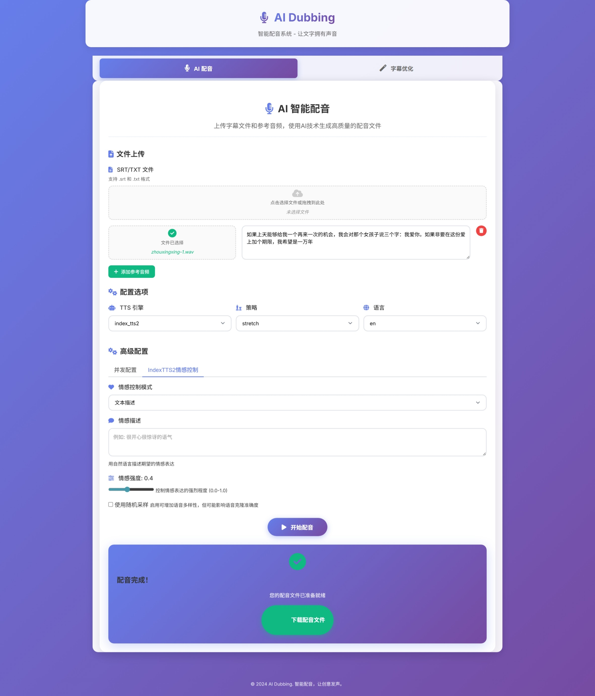

# AI配音工具

## 📖 项目介绍

AI配音工具是一个专业的AI语音克隆配音解决方案，通过先进的TTS模型将SRT字幕文件或TXT文本转换为高质量的配音音频。工具支持多种时间同步策略，能够精确匹配字幕时长，生成与视频完美同步的配音。

### 主要特性

- **🎯 精确同步**: 支持时间拉伸策略，确保配音与字幕时长完全匹配
- **🎨 高质量音频**: 基于Fish-speech\IndexTTS\IndexTTS2\CosyVoice\F5等模型，生成自然流畅的语音
- **⚙️ 灵活策略**: 提供基础策略和拉伸策略，适应不同需求
- **🎭 情感控制**: IndexTTS2引擎支持情感表达控制，可通过音频、向量、文本等方式调节语音情感
- **✨ 图形化界面**: 提供直观易用的 Web UI，支持文件拖拽上传、参数在线配置和实时进度展示，极大简化了操作流程。
- **📊 实时监控**: 专业日志系统，实时显示处理进度和状态

## 🏗️ 项目架构

```
open-dubbing/
├── run.sh                     # 一键部署启动脚本（Fish Speech）
├── install.sh                 # Fish Speech 环境安装脚本
├── install-index-tts.sh       # IndexTTS 环境安装脚本
├── install-index-tts2.sh      # IndexTTS2 环境安装脚本
├── install-f5-tts.sh          # F5-TTS 环境安装脚本
├── install-cosyvoice.sh       # CosyVoice 环境安装脚本
├── server.py                  # Web UI 服务启动脚本
├── requirements.txt           # Python 依赖包
├── ai_dubbing/
│   ├── run_dubbing.py            # [入口] 基于配置文件的配音任务
│   ├── run_optimize_subtitles.py # [入口] 基于配置文件的字幕优化任务（翻译后的中文字幕时长不合理的问题）
│   ├── dubbing.conf.example   # 配置文件模板
│   ├── web/
│   │   ├── static/              # 存放 CSS, JavaScript 等静态文件
│   │   └── templates/           # 存放 HTML 模板文件
│   ├── src/
│   │   ├── __init__.py            # 模块初始化
│   │   ├── config.py              # 配置管理
│   │   ├── utils/                 # 工具包
│   │   │   ├── __init__.py
│   │   │   └── common_utils.py
│   │   ├── logger.py              # 日志系统
│   │   ├── audio_processor.py     # 音频处理器
│   │   ├── parsers/               # 统一解析器模块
│   │   │   ├── __init__.py        # 解析器导出
│   │   │   ├── srt_parser.py      # SRT解析器
│   │   │   └── txt_parser.py      # TXT解析器
│   │   └── strategies/            # 同步策略
│   │       ├── __init__.py        # 策略注册
│   │       ├── base_strategy.py   # 抽象基类
│   │       ├── basic_strategy.py  # 基础策略
│   │       └── stretch_strategy.py # 时间拉伸策略
│   │   └── tts_engines/           # TTS引擎
│   │       ├── __init__.py        # 引擎注册
│   │       ├── base_engine.py     # 抽象基类
│   │       ├── index_tts_engine.py # IndexTTS引擎
│   │       ├── index_tts2_engine.py # IndexTTS2引擎
│   │       ├── f5_tts_engine.py   # F5-TTS引擎
│   │       ├── cosy_voice_engine.py # CosyVoice引擎
│   │       └── fish_speech_engine.py # Fish Speech引擎
└── README.md                  # 说明文档
```

## 🚀 快速开始

### 一键部署启动（推荐）

项目提供了 `run.sh` 一键部署脚本，可以自动完成环境配置、依赖安装、模型下载和服务启动：

```bash
./run.sh
```

**脚本功能：**
- 🔧 自动创建和激活 `fish-speech` Conda 环境
- 📦 安装所有必需的依赖包（包括 FFmpeg、PyTorch 等）
- 🔗 克隆和安装 Fish Speech 引擎
- 📥 下载预训练模型（openaudio-s1-mini）
- ⚙️ 自动生成配置文件
- 🌐 启动 Web UI 服务器

执行完成后，服务将在 `http://127.0.0.1:8000` 运行，您可以直接在浏览器中开始使用。

### 手动环境配置

项目为每个 TTS 引擎提供了独立的安装脚本，您可以根据需要选择安装：

#### Fish Speech 引擎（推荐）
```bash
./install.sh
# 或者使用具体的脚本名
./install-fish-speech.sh
```

#### IndexTTS 引擎
```bash
./install-index-tts.sh
```

#### IndexTTS2 引擎
```bash
./install-index-tts2.sh
```

#### F5-TTS 引擎
```bash
./install-f5-tts.sh
```

#### CosyVoice 引擎
```bash
./install-cosyvoice.sh
```

**安装后启动服务：**

每个 TTS 引擎使用独立的 conda 环境，激活对应环境后启动服务：

```bash
# Fish Speech 引擎
conda activate fish-speech
python server.py

# IndexTTS 引擎  
conda activate index-tts
python server.py

# IndexTTS2 引擎  
conda activate index-tts2
python server.py

# F5-TTS 引擎
conda activate f5-tts
python server.py

# CosyVoice 引擎
conda activate cosyvoice
python server.py
```

> **注意**：在 Web UI 中记得将 TTS 引擎设置为对应的引擎类型（`fish_speech`、`index_tts`、`index_tts2`、`f5_tts`、`cosy_voice`）。

## 📝 使用说明

### 💻 Web UI 交互界面

为了提供更直观、便捷的操作体验，项目内置了一个基于 FastAPI 的 Web 界面。

#### 启动 Web 服务

在项目根目录下运行以下命令：

```bash
python server.py
```

服务启动后，在浏览器中打开 `http://127.0.0.1:8000` 即可访问。

#### 界面功能概览



Web UI 主要分为以下几个功能区域：

1.  **文件上传区**:
    *   **SRT/TXT 文件**: 上传您的主字幕文件。
    *   **参考音频**: 点击 “添加参考音频” 按钮，可以添加一个或多个参考音频-文本对。每个参考音频都需要一段对应的文本，用于声音克隆。

2.  **配置选项**:
    *   **TTS 引擎**: 选择用于语音合成的核心模型（如 `fish_speech`）。
    *   **策略**: 选择音频与字幕的时间同步策略（如 `stretch` 策略会严格匹配时长）。
    *   **语言**: 选择字幕对应的语言。

3.  **高级配置**:
    *   提供对 **并发数**、**字幕优化**、**时间借用** 等高级参数的精细调整。
    *   **IndexTTS2情感控制**: 当选择 `index_tts2` 引擎时，会显示专门的情感控制面板，支持：
        *   **情感模式**: 自动分析、音频提示、情感向量、文本描述四种模式
        *   **情感强度**: 可调节情感表达的强烈程度 (0.0-1.0)
        *   **随机采样**: 增加语音的自然变化
    *   所有配置修改后，可点击 **"保存配置"** 将其写入 `dubbing.conf` 文件，以便命令行或其他方式复用。

4.  **开始处理**:
    *   所有参数设置完毕后，点击 **“开始配音”** 按钮启动任务。
    *   处理过程中，页面会实时显示任务进度。完成后，会提供最终音频文件的下载链接。

### python脚本方式运行（备选）

#### 1. 创建配置文件
复制配置文件模板并修改：

```bash
cp ai_dubbing/dubbing.conf.example ai_dubbing/dubbing.conf
```

#### 2. 编辑配置文件
修改 `ai_dubbing/dubbing.conf` 中的参数：

```ini
# SRT配音工具配置文件
# 复制此文件并根据实际需求修改参数

[基本配置]
# 输入文件路径（SRT或TXT，必须指定）
input_file = subtitles/movie.srt

# 参考语音文件路径（支持 wav/mp3，多条用逗号分隔）
voice_files = voices/ref1.wav, voices/ref2.mp3

# 参考音频对应文本（与 voice_files 一一对应，文本使用双引号包裹）
prompt_texts = "这是第一段参考音频文本", "这是第二段参考音频文本"

# 输出音频文件路径（默认：output.wav）
output_file = output/movie_dubbed.wav

# TTS引擎选择：fish_speech, index_tts, index_tts2, f5_tts, cosy_voice
tts_engine = fish_speech

# 时间同步策略：stretch, basic
# 注意：TXT文件模式下系统会自动使用basic策略
strategy = stretch

[高级配置]
# 语言设置：zh, en, ja, ko（TXT模式专用）
language = zh

[IndexTTS2情感控制]
# 情感控制模式：auto(自动), audio(音频提示), vector(情感向量), text(文本描述)
emotion_mode = auto

# 情感音频文件路径（emotion_mode = audio 时使用）
emotion_audio_file = emotions/happy.wav

# 情感向量（emotion_mode = vector 时使用，8个数值，逗号分隔）
emotion_vector = 0.1, 0.2, 0.3, 0.4, 0.5, 0.6, 0.7, 0.8

# 情感文本描述（emotion_mode = text 时使用）
emotion_text = 开心愉悦的语调

# 情感强度（0.0-1.0，默认0.8）
emotion_alpha = 0.8

# 是否使用随机采样（增加自然变化，默认false）
use_random = false
```

#### 3. 运行配音
```bash
python ai_dubbing/run_dubbing.py
```

### 仅优化字幕（不合成音频）

```bash
python ai_dubbing/run_optimize_subtitles.py
```
