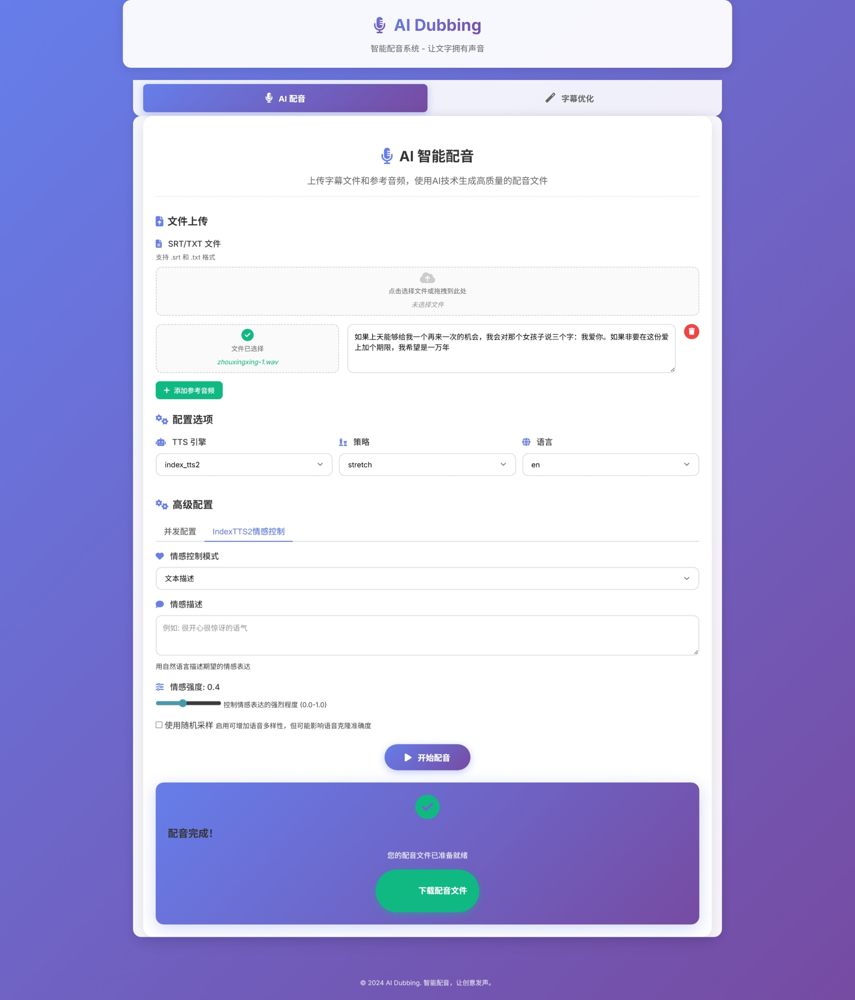

# AI配音工具

## 📖 项目介绍

AI配音工具是一个专业的AI语音克隆配音解决方案，通过先进的TTS模型将SRT字幕文件或TXT文本转换为高质量的配音音频。工具支持多种时间同步策略，能够精确匹配字幕时长，生成与视频完美同步的配音。

### 主要特性

- **🎯 精确同步**: 支持时间拉伸策略，确保配音与字幕时长完全匹配
- **🎨 高质量音频**: 基于Fish-speech\IndexTTS2\CosyVoice\F5等模型，生成自然流畅的语音
- **⚙️ 灵活策略**: 提供基础策略和拉伸策略，适应不同需求
- **🎭 情感控制**: IndexTTS2引擎支持情感表达控制，可通过音频、向量、文本等方式调节语音情感
- **✨ 图形化界面**: 提供直观易用的 Web UI，支持文件拖拽上传、参数在线配置和实时进度展示，极大简化了操作流程。
- **📊 实时监控**: 专业日志系统，实时显示处理进度和状态

### 🎬 演示视频

[点击查看演示视频](resources/open-dubbing.mp4)

## 🏗️ 项目架构

```text
open-dubbing/
├── run.sh                     # 一键部署启动脚本（默认 index-tts2）
├── install-fish-speech.sh     # Fish Speech 环境安装脚本
├── install-index-tts2.sh      # IndexTTS2 环境安装脚本
├── install-f5-tts.sh          # F5-TTS 环境安装脚本
├── install-cosyvoice.sh       # CosyVoice 环境安装脚本
├── server.py                  # Web UI 服务启动脚本
├── requirements.txt           # Python 依赖包
├── ai_dubbing/
│   ├── run_dubbing.py            # [入口] 基于命令行参数的配音任务
│   ├── run_optimize_subtitles.py # [入口] 基于配置文件的字幕优化任务（翻译后的中文字幕时长不合理的问题）
│   ├── dubbing.conf.example   # 配置文件模板
│   ├── web/
│   │   ├── static/              # 存放 CSS, JavaScript 等静态文件
│   │   └── templates/           # 存放 HTML 模板文件
│   ├── src/
│   │   ├── __init__.py            # 模块初始化
│   │   ├── config.py              # 配置管理
│   │   ├── utils/                 # 工具包
│   │   │   ├── __init__.py
│   │   │   └── common_utils.py
│   │   ├── logger.py              # 日志系统
│   │   ├── audio_processor.py     # 音频处理器
│   │   ├── parsers/               # 统一解析器模块
│   │   │   ├── __init__.py        # 解析器导出
│   │   │   ├── srt_parser.py      # SRT解析器
│   │   │   └── txt_parser.py      # TXT解析器
│   │   └── strategies/            # 同步策略
│   │       ├── __init__.py        # 策略注册
│   │       ├── base_strategy.py   # 抽象基类
│   │       ├── basic_strategy.py  # 基础策略
│   │       └── stretch_strategy.py # 时间拉伸策略
│   │   └── tts_engines/           # TTS引擎
│   │       ├── __init__.py        # 引擎注册
│   │       ├── base_engine.py     # 抽象基类
│   │       ├── index_tts2_engine.py # IndexTTS2引擎
│   │       ├── f5_tts_engine.py   # F5-TTS引擎
│   │       ├── cosy_voice_engine.py # CosyVoice引擎
│   │       └── fish_speech_engine.py # Fish Speech引擎
└── README.md                  # 说明文档
```

## 🚀 快速开始

### 获取源码

本项目依赖以下第三方源码仓库，并且固定到经过验证的 commit，不跟随上游最新版本漂移：

| 路径 | 上游仓库 | 固定 commit |
| --- | --- | --- |
| `deps/CosyVoice` | `https://github.com/FunAudioLLM/CosyVoice` | `ace7c47f41bbd303aa6bf1ea80e6f9fbd595cd40` |
| `deps/fish-speech` | `https://github.com/fishaudio/fish-speech` | `19308b308347198a834651fccd755964246c7d0b` |
| `deps/index-tts` | `https://github.com/index-tts/index-tts` | `db5b39bb6ad903c219b2dd33d60b0f0bdaede664` |

推荐使用带 submodule 的方式克隆：

```bash
git clone --recursive <your-repo-url>
cd open-dubbing
```

如果已经 clone 过主仓库，再执行一次：

```bash
git submodule update --init --recursive
```

说明：

- 安装脚本只会初始化仓库中已经锁定的 submodule 版本，不会自动拉取上游最新源码
- 如果未初始化 submodule，请先执行上面的命令，再运行各引擎安装脚本

### 一键部署启动（推荐）

项目提供了 `run.sh` 一键部署脚本，可以自动完成环境配置、依赖安装、模型下载和服务启动：

```bash
./run.sh
```

**脚本功能：**

- 🔧 自动创建和激活 `index-tts2` Conda 环境
- 📦 安装所有必需的依赖包（包括 FFmpeg、PyTorch 等）
- 🔗 初始化并安装已锁定版本的 IndexTTS2 引擎
- 📥 下载预训练模型
- ⚙️ 自动生成配置文件
- 🌐 启动 Web UI 服务器

执行完成后，服务将在 `http://127.0.0.1:8000` 运行，您可以直接在浏览器中开始使用。

### 手动环境配置

项目为每个 TTS 引擎提供了独立的安装脚本，您可以根据需要选择安装：

#### IndexTTS2 引擎（推荐）

默认使用模型：`IndexTTS-2`

```bash
./install-index-tts2.sh
```

#### Fish Speech 引擎

默认使用模型：`openaudio-s1-mini`

```bash
./install-fish-speech.sh
# 或者使用具体的脚本名
./install-fish-speech.sh
```

#### F5-TTS 引擎

默认使用模型：`F5TTS_v1_Base`

```bash
./install-f5-tts.sh
```

#### CosyVoice 引擎

默认使用模型：`Fun-CosyVoice3-0.5B`

```bash
./install-cosyvoice.sh
```

**安装后启动服务：**

每个 TTS 引擎使用独立的 conda 环境，激活对应环境后启动服务：

```bash
# Fish Speech 引擎
conda activate fish-speech
python server.py

# IndexTTS2 引擎  
conda activate index-tts2
python server.py

# F5-TTS 引擎
conda activate f5-tts
python server.py

# CosyVoice 引擎
conda activate cosyvoice
python server.py
```

> **注意**：在 Web UI 中记得将 TTS 引擎设置为对应的引擎类型（`fish_speech`、`index_tts2`、`f5_tts`、`cosy_voice`）。

## 📝 使用说明

### 💻 Web UI 交互界面

为了提供更直观、便捷的操作体验，项目内置了一个基于 FastAPI 的 Web 界面。

#### 启动 Web 服务

在项目根目录下运行以下命令：

```bash
python server.py
```

服务启动后，在浏览器中打开 `http://127.0.0.1:8000` 即可访问。

#### 界面功能概览



Web UI 主要分为以下几个功能区域：

1. **文件上传区**：
   - **SRT/TXT 文件**：上传您的主字幕文件。
   - **参考音频**：点击“添加参考音频”按钮，可以添加一个或多个参考音频-文本对。每个参考音频都需要一段对应的文本，用于声音克隆。

2. **配置选项**：
   - **TTS 引擎**：选择用于语音合成的核心模型，如 `fish_speech`。
   - **策略**：选择音频与字幕的时间同步策略，如 `stretch` 策略会严格匹配时长。
   - **语言**：选择字幕对应的语言。

3. **高级配置**：
   - 提供对 **并发数**、**字幕优化**、**时间借用** 等高级参数的精细调整。
   - **IndexTTS2 情感控制**：当选择 `index_tts2` 引擎时，会显示专门的情感控制面板，支持以下能力：
     - **情感模式**：自动分析、音频提示、情感向量、文本描述四种模式。
     - **情感强度**：可调节情感表达的强烈程度（`0.0-1.0`）。
     - **随机采样**：增加语音的自然变化。
   - 所有配置修改后，可点击 **“保存配置”** 将其写入 `dubbing.conf` 文件，便于 Web 端或其他配置文件流程复用。

4. **开始处理**：
   - 所有参数设置完毕后，点击 **“开始配音”** 按钮启动任务。
   - 处理过程中，页面会实时显示任务进度。完成后，会提供最终音频文件的下载链接。

### python脚本方式运行模式(给第三方程序调用或者AI Agent调用)

#### 1. 直接传入命令行参数

先激活对应的 Python / Conda 环境。默认命令行示例基于 `index-tts2` 环境：

```bash
conda activate index-tts2
```

环境和引擎映射如下：

| TTS 引擎参数 | Conda 环境 | 默认模型 |
| --- | --- | --- |
| `index_tts2` | `index-tts2` | `IndexTTS-2` |
| `fish_speech` | `fish-speech` | `openaudio-s1-mini` |
| `f5_tts` | `f5-tts` | `F5TTS_v1_Base` |
| `cosy_voice` | `cosyvoice` | `Fun-CosyVoice3-0.5B` |

如果你要切换到其他引擎，请先激活上表对应环境，再执行下面的命令。

```bash
python ai_dubbing/run_dubbing.py \
  --input-file "subtitles/movie.srt" \
  --output-file "output/movie_dubbed.wav"
```

常用参数说明：

```text
--input-file             输入文件路径（SRT 或 TXT，必填）
--output-file            输出音频文件路径（必填）
--voice-files            参考音频列表；默认使用内置 mcs 音频
--prompt-texts           参考文本列表；默认使用内置 mcs 参考文本
--tts-engine             可选：index_tts2, fish_speech, f5_tts, cosy_voice；默认 index_tts2
--strategy               可选：stretch, basic；未传时自动选择（SRT=stretch，TXT=basic）
--emotion-text           IndexTTS2 文本情感描述，默认“平静”
--emotion-alpha          情感强度，默认 0.5
```

如果你要覆盖默认参考音频/文本，可以这样传：

```bash
python ai_dubbing/run_dubbing.py \
  --input-file "subtitles/movie.srt" \
  --output-file "output/movie_dubbed.wav" \
  --voice-files "voices/ref1.wav" "voices/ref2.mp3" \
  --prompt-texts "这是第一段参考音频文本" "这是第二段参考音频文本" \
  --tts-engine index_tts2 \
  --emotion-text "平静、克制" \
  --emotion-alpha 0.5
```

策略默认会按输入类型自动决定：

```text
SRT / 字幕文件 -> stretch
TXT / 纯文本文件 -> basic
```

#### IndexTTS2启动注意事项

需要注意的是，社区版 `index-tts` 在加载 `w2v-bert`、`MaskGCT`、`campplus`、`bigvgan` 等辅助依赖时，会使用相对路径 `./checkpoints/hf_cache` 作为缓存目录。因此必须先切换到预期的工作目录，否则这些缓存可能会落到当前目录对应的 `./checkpoints/hf_cache` 下，并触发重复下载。

推荐写法：

```bash
cd /home/xiaofei/code/open-dubbing
python ai_dubbing/run_dubbing.py \
  --input-file "/mnt/c/path/to/input.srt" \
  --output-file "/mnt/c/path/to/output.wav"
```

如果从 Windows 侧调用 `wsl.exe`，也建议显式先 `cd`：

```bash
wsl.exe -e bash -lc "cd /home/xiaofei/code/open-dubbing && conda run -n index-tts2 --no-capture-output python /home/xiaofei/code/open-dubbing/ai_dubbing/run_dubbing.py --input-file /mnt/c/path/to/input.srt --output-file /mnt/c/path/to/output.wav"
```

### 仅优化字幕（不合成音频）

```bash
python ai_dubbing/run_optimize_subtitles.py
```
