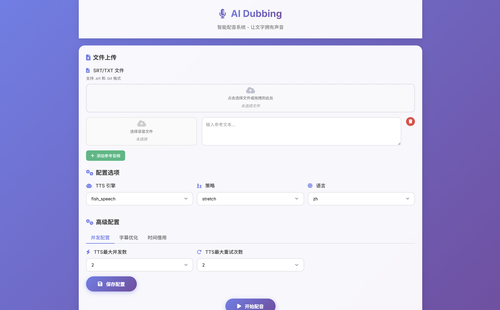

# AI配音工具

## 📖 项目介绍

AI配音工具是一个专业的AI语音克隆配音解决方案，通过先进的TTS模型将SRT字幕文件或TXT文本转换为高质量的配音音频。工具支持多种时间同步策略，能够精确匹配字幕时长，生成与视频完美同步的配音。

### 主要特性

- **🎯 精确同步**: 支持时间拉伸策略，确保配音与字幕时长完全匹配
- **🎨 高质量音频**: 基于Fish-speech\IndexTTS\CosyVoice\F5等模型，生成自然流畅的语音
- **⚙️ 灵活策略**: 提供基础策略和拉伸策略，适应不同需求
- **✨ 图形化界面**: 提供直观易用的 Web UI，支持文件拖拽上传、参数在线配置和实时进度展示，极大简化了操作流程。
- **📊 实时监控**: 专业日志系统，实时显示处理进度和状态

## 🏗️ 项目架构

```
open-dubbing/
├── server.py                  # Web UI 服务启动脚本
├── requirements.txt           # Python 依赖包
├── ai_dubbing/
│   ├── run_dubbing.py            # [入口] 基于配置文件的配音任务
│   ├── run_optimize_subtitles.py # [入口] 基于配置文件的字幕优化任务（翻译后的中文字幕时长不合理的问题）
│   ├── dubbing.conf.example   # 配置文件模板
│   ├── web/
│   │   ├── static/              # 存放 CSS, JavaScript 等静态文件
│   │   └── templates/           # 存放 HTML 模板文件
│   ├── src/
│   │   ├── __init__.py            # 模块初始化
│   │   ├── config.py              # 配置管理
│   │   ├── utils/                 # 工具包
│   │   │   ├── __init__.py
│   │   │   └── common_utils.py
│   │   ├── logger.py              # 日志系统
│   │   ├── audio_processor.py     # 音频处理器
│   │   ├── parsers/               # 统一解析器模块
│   │   │   ├── __init__.py        # 解析器导出
│   │   │   ├── srt_parser.py      # SRT解析器
│   │   │   └── txt_parser.py      # TXT解析器
│   │   └── strategies/            # 同步策略
│   │       ├── __init__.py        # 策略注册
│   │       ├── base_strategy.py   # 抽象基类
│   │       ├── basic_strategy.py  # 基础策略
│   │       └── stretch_strategy.py # 时间拉伸策略
│   │   └── tts_engines/           # TTS引擎
│   │       ├── __init__.py        # 引擎注册
│   │       ├── base_engine.py     # 抽象基类
│   │       ├── index_tts_engine.py # IndexTTS引擎
│   │       ├── f5_tts_engine.py   # F5-TTS引擎
│   │       ├── cosy_voice_engine.py # CosyVoice引擎
│   │       └── fish_speech_engine.py # Fish Speech引擎
└── README.md                  # 说明文档
```

## 🛠️ 环境配置

环境安装和配置请参考 [INSTALL.md](INSTALL.md) 文件。

## 📝 使用说明

支持两种使用方式：**配置文件方式**（推荐）和**命令行参数方式**。另外，项目还提供一个简单的 Web 界面方便快速体验配音流程。

### 💻 Web UI 交互界面

为了提供更直观、便捷的操作体验，项目内置了一个基于 FastAPI 的 Web 界面。

#### 启动 Web 服务

在项目根目录下运行以下命令：

```bash
python server.py
```

服务启动后，在浏览器中打开 `http://127.0.0.1:8000` 即可访问。

#### 界面功能概览



Web UI 主要分为以下几个功能区域：

1.  **文件上传区**:
    *   **SRT/TXT 文件**: 上传您的主字幕文件。
    *   **参考音频**: 点击 “添加参考音频” 按钮，可以添加一个或多个参考音频-文本对。每个参考音频都需要一段对应的文本，用于声音克隆。

2.  **配置选项**:
    *   **TTS 引擎**: 选择用于语音合成的核心模型（如 `fish_speech`）。
    *   **策略**: 选择音频与字幕的时间同步策略（如 `stretch` 策略会严格匹配时长）。
    *   **语言**: 选择字幕对应的语言。

3.  **高级配置**:
    *   提供对 **并发数**、**字幕优化**、**时间借用** 等高级参数的精细调整。
    *   所有配置修改后，可点击 **“保存配置”** 将其写入 `dubbing.conf` 文件，以便命令行或其他方式复用。

4.  **开始处理**:
    *   所有参数设置完毕后，点击 **“开始配音”** 按钮启动任务。
    *   处理过程中，页面会实时显示任务进度。完成后，会提供最终音频文件的下载链接。

### python脚本方式运行（备选）

#### 1. 创建配置文件
复制配置文件模板并修改：

```bash
cp ai_dubbing/dubbing.conf.example ai_dubbing/dubbing.conf
```

#### 2. 编辑配置文件
修改 `ai_dubbing/dubbing.conf` 中的参数：

```ini
# SRT配音工具配置文件
# 复制此文件并根据实际需求修改参数

[基本配置]
# 输入文件路径（SRT或TXT，必须指定）
input_file = subtitles/movie.srt

# 参考语音文件路径（支持 wav/mp3，多条用逗号分隔）
voice_files = voices/ref1.wav, voices/ref2.mp3

# 参考音频对应文本（与 voice_files 一一对应，文本使用双引号包裹）
prompt_texts = "这是第一段参考音频文本", "这是第二段参考音频文本"

# 输出音频文件路径（默认：output.wav）
output_file = output/movie_dubbed.wav

# TTS引擎选择：fish_speech, index_tts, f5_tts, cosy_voice
tts_engine = fish_speech

# 时间同步策略：stretch, basic
# 注意：TXT文件模式下系统会自动使用basic策略
strategy = stretch

[高级配置]
# 语言设置：zh, en, ja, ko（TXT模式专用）
language = zh
```

#### 3. 运行配音
```bash
python ai_dubbing/run_dubbing.py
```

### 仅优化字幕（不合成音频）

```bash
python ai_dubbing/run_optimize_subtitles.py
```